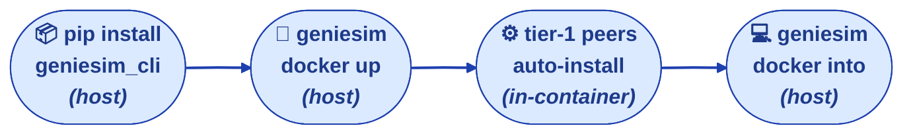
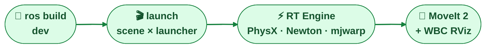
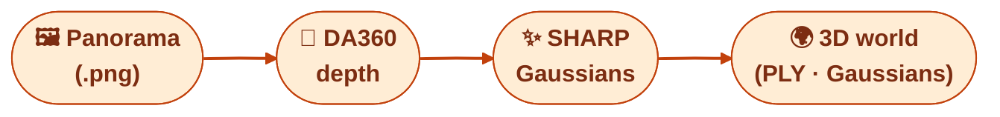
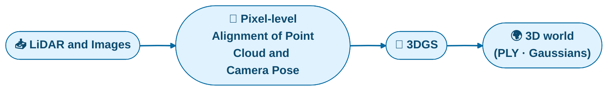
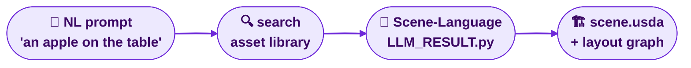
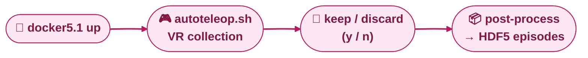
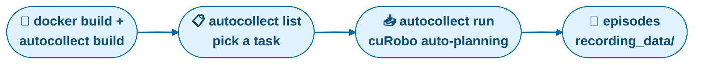
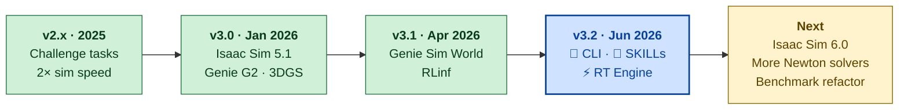

<div align="center">
  <a href="https://arxiv.org/abs/2601.02078" style="text-decoration:none;">
    
  </a>
  <a href="https://github.com/AgibotTech/genie_sim">
    
  </a>
  <a href="http://agibot-world.com/genie-sim">
    
  </a>
  <a href="https://huggingface.co/datasets/agibot-world/GenieSimAssets">
    
  </a>
  <a href="https://modelscope.cn/datasets/agibot_world/GenieSim3.0-Dataset">
    
  </a>
  <div align="center">
    <a href="https://agibot-world.com/videos/genieSim/modules/heroFullVideoEn.mp4" target="_blank">
      
    </a>
  </div>
</div>

# 1. 🌍 Genie Sim

**Genie Sim is the simulation platform from AgiBot.** It provides developers with a complete toolchain for *environment reconstruction*, *scene generalization*, *data collection*, and *automated evaluation*. Its core module, **Genie Sim Benchmark** is a standardized tool dedicated to establishing the most accurate and authoritative evaluation for embodied intelligence.

The platform integrates **3D reconstruction** with **visual generation** to create a high-fidelity simulation environment. It pioneers **LLM-driven technology** to generate vast simulation scenes and evaluation configurations in minutes. The evaluation system covers **200+ tasks** across **100,000+ scenarios** to establish a comprehensive capability profile for models. Genie Sim also opens over **10,000 hours of synthetic data** including real-world robot operation scenarios.

The platform will significantly accelerate model development, reduce reliance on physical hardware, and empower innovation in embodied intelligence. Simulation assets, dataset, and code are **fully open source**.

# 2. ✨ Features

- 🧞 **`geniesim` CLI**: one command-line entry point for the entire platform — docker lifecycle, ROS 2 workspace builds, health diagnosis (`doctor`), pure-Python wheel deploy, asset / scene bootstrap. Packaged as a standalone PEP 517 / PEP 621 wheel.
- 🤖 **Agent-ready SKILLs**: packaged `SKILL.md` recipes for benchmarking, inference checks, scene generation, asset search, and teleop — invokable directly by Claude Code / agentic coding agents, so the simulator can be driven without a human first reading the docs.
- ⚡ **Genie Sim RT Engine (realtime, interactive)**: `geniesim_ros` brings physics, render, and the robot into ROS 2 natively — teleop, MoveIt, and ros2_control close the loop on one shared `sim_time`. Multiple physics backends (Isaac Sim PhysX, Newton-standalone) selectable per scene, with cloth + soft-body support on the Newton path.
- 🎨 **High-Fidelity Sim-Ready Assets**: 5,140 validated 3D assets covering five real-world operation fields: retail, industry, catering, home and office. [ModelScope](https://modelscope.cn/datasets/agibot_world/GenieSimAssets).
- 🛰️ **3DGS-based Reconstruction Pipeline**: Integrate 3DGS-based reconstruction process with visual generative model to synthesize realistic simulation environment with high-precision meshes. [ModelScope](https://modelscope.cn/datasets/agibot_world/GenieSim3.0-Dataset).
- 🌐 <b><big>Genie Sim World: A multimodal spatial world model which generates photorealistic 3D world from diverse input types in minutes.</big></b> [GitHub](source/geniesim_world).
- 💬 **LLM-Driven Scene Generation**: Natural language-driven generation and generalization which instantly generates diverse simulation scenes through conversational interaction.
- 📦 **Large-Scale Synthetic Dataset**: Over 10,000 hours open-source synthetic data across 200+ loco-manipulation tasks with multi-sensor streams, alongside multi-dimensional variations.
- 🛠️ **Synthetic Data Generation**: Efficient toolkit for data collection with error-recovery mechanism, supporting both low-latency teleoperation and automated data programming. [ModelScope](https://modelscope.cn/datasets/agibot_world/GenieSim3.0-Dataset).
- 🧪 **Robust and Diverse Benchmark**: Provide 100,000+ simulation scenarios and use LLM to autonomously generate task instructions and evaluation configurations. Discrepancy between simulation and real-world test results is less than 10%.
- 🔍 **VLM-based Auto-Evaluation System**: Full-spectrum evaluation criteria to provide model's capability profile covering manipulation skills, cognitive comprehension and task complexity.
- 🚀 **Zero-Shot Sim-to-Real Transfer**: Model trained with our synthetic data exhibits zero-shot sim-to-real transfer capability with superior task success rate compared to model trained with real data.

# 3. 🚀 Quick start

### 3.1 🧞 CLI & 🤖 SKILLs — install, build the container, get a shell



```bash
# === on the host ===
pip install -e source/geniesim_cli/      # standalone CLI wheel
geniesim docker build                    # build the Isaac Sim 5.1 + Jazzy image
geniesim docker up                       # boot the container; the entrypoint
                                         # editable-installs every tier-1 from
                                         # the bind-mounted workspace
geniesim docker into                     # interactive shell inside the container

# === inside the container — sanity-check the stack ===
geniesim status                          # per-distribution health probe
geniesim doctor                          # diagnose & repair (rosdep, env, …)
geniesim bootstrap                       # re-install tier-1 peers + opt-in tier-2
```

#### 🤖 With an AI assistant — just ask

The repo ships `AGENTS.md` + per-package `skills/<name>/SKILL.md` as machine-readable signposts. Claude Code, Cursor, etc. follow them on their own — say _"run the pnp benchmark against localhost:8999"_ or _"launch the WBC scene with MoveIt"_ and the agent walks the trail.

#### 📖 Without an AI assistant — follow the signposts

[`AGENTS.md`](AGENTS.md) (root, boot sequence) → [`source/AGENTS.md`](source/AGENTS.md) (module map) → `source/<pkg>/AGENTS.md` (architecture + commands) → `source/<pkg>/skills/<name>/SKILL.md` (copy-paste recipes). Full CLI verb table: [`.agent/geniesim_cli.md`](.agent/geniesim_cli.md).

> [!IMPORTANT]
> 🎨 **Tier-1 peers come up automatically; tier-2 peers are opt-in.** `geniesim docker up`'s entrypoint editable-installs every tier-1 peer
> declared in `source/geniesim/pyproject.toml`. The asset library `geniesim_assets` is a tier-1 peer distributed **out of band**
> (sourced from [HuggingFace](https://huggingface.co/datasets/agibot-world/GenieSimAssets) / [ModelScope](https://modelscope.cn/datasets/agibot_world/GenieSimAssets)),
> and editable-installed by the entrypoint so every other peer can find it.
>
> Tier-2 peers (`geniesim_teleop` · `geniesim_generator` · `geniesim_world`) have heavy stacks (VR / LLM / CUDA-ML) and are **not** auto-installed.
> Install with `pip install -e "source/geniesim/[teleop|generator|world|all]"` — or run `geniesim bootstrap` for an interactive re-install of the whole tree.

### 3.2 🧪 Benchmark — debug locally, compete globally on the AgiBot World Challenge: Open-Session


The Genie Sim Benchmark is the engine behind the [**AgiBot World Challenge: Open-Session**](https://agibot-world.com/challenge/open-session/) — and the same tool you use to get ready for it:

- **🏆 It's a competition.** Open-Session ranks embodied-AI policies on four boards (`instruction` / `robust` / `manip` / `spatial`). The boards and their baseline scores are in the [Genie Sim Benchmark Leaderboard](#52--genie-sim-benchmark-leaderboard) below.
- **🧪 Debug locally → submit remotely.** Run the benchmark tasks on your own machine to debug your policy against your own inference server, then launch a model evaluation on the official leaderboard with the _same_ server — no blind submissions.
- **🤖 Agent-friendly one-click SKILLs.** The whole competition pipeline — download datasets, fetch the π<sub>0.5</sub> baseline weights, run an example leaderboard service, submit & track results — ships under [`source/geniesim_benchmark/skills/agibot-world-challenge/`](source/geniesim_benchmark/skills/agibot-world-challenge/); just ask an AI agent (Claude Code, Cursor, …) to drive them.

**Run it locally** — `cat source/geniesim_benchmark/USAGE.md` for how to run a benchmark task on your own machine against your inference server (CLI verbs, common commands, and overrides).

### 3.3 ⚡ RT Engine — realtime, interactive ROS 2 simulation



The RT Engine ships its own SKILLs that walk you through every step — workspace build → scene launch → MoveIt + WBC RViz → bringing your own robot → teleop → recording → debugging. Don't memorize `ros2 launch` flags — follow the skill:

```bash
# inside the container:
geniesim ros build dev
cat source/geniesim_ros/skills/build-workspace/SKILL.md    # `geniesim ros build dev`
cat source/geniesim_ros/skills/launch-scene/SKILL.md       # scene × launcher matrix
cat source/geniesim_ros/skills/moveit-wbc/SKILL.md         # MoveIt 2 + WBC RViz for Genie G2
cat source/geniesim_ros/skills/add-robot/SKILL.md          # bring your own URDF / xacro
cat source/geniesim_ros/skills/*/SKILL.md                  # and more
```

### 3.4 🌐 Generate a 3D world — `geniesim_world`



Turn an equirectangular panorama into an explorable photorealistic 3D world. _(Loading the output into the RT Engine is a 🚧 W.I.P. — for now the generated PLY / Gaussians are consumed by `geniesim_world`'s own tooling.)_

```bash
cat source/geniesim_world/skills/generate-world/SKILL.md
```

### 3.5 🧱 Scene Reconstruction — `scene_reconstruction`



Reconstruct high-fidelity 3D scene assets from real-world LiDAR scans and camera images. The pipeline aligns point clouds with camera poses at pixel level, trains 3D Gaussian Splatting, and produces simulation-ready assets.

```bash
cat source/scene_reconstruction/AGENTS.md
```

See [`source/scene_reconstruction/README.md`](source/scene_reconstruction/README.md) for the full pipeline details and [`AGENTS.md`](AGENTS.md) for the per-subsystem agent guides.

### 3.6 💬 Generate a scene from a prompt — `geniesim_generator`



Describe a scene in words; an LLM grounds it against the asset library, writes a Scene-Language DSL program, and the generator compiles it into `scene.usda` + a relationship graph. Drive it through the Open WebUI agent loop, or have Claude write the DSL directly (no WebUI / no MCP server). Embeddings run via a text-embedding API (no GPU) or a local VL model (GPU) — your pick at deploy time.

Generated scenes are written under `source/geniesim_generator/src/benchmark/config/llm_task/<scene_id>/<run_id>/`. If generated inside the Docker stack, the same bind-mounted files appear at `/opt/geniesim_generator/src/benchmark/config/llm_task/<scene_id>/<run_id>/` in the container and at the `source/...` path on the host. Open the resulting `scene.usda` with Isaac Sim **inside the Genie Sim container** so its payload paths resolve as generated; if you open it from the host side, adjust the payload paths inside the USDA first.

```bash
cat source/geniesim_generator/skills/deploy-generator/SKILL.md    # install + start: MCP stack + Open WebUI, text vs VL embeddings
cat source/geniesim_generator/skills/search-assets/SKILL.md       # query the asset index by concept
cat source/geniesim_generator/skills/generate-scene/SKILL.md      # prompt → LLM_RESULT.py → scene.usda
```

See [`source/geniesim_ros/README.md`](source/geniesim_ros/README.md) for the engine overview, [`source/README.md`](source/README.md) for the full module map (every `geniesim_*` package with its docs + skills), and [`AGENTS.md`](AGENTS.md) for the per-subsystem agent guides.

### 3.7 🎮 Teleoperation — `geniesim_teleop`



Collect demonstration data by teleoperating the robot with a Pico VR headset, then turn the recorded rosbags into HDF5 episodes. Once the image is built and the GUI container is up (`geniesim docker5.1 up` succeeds), the whole flow is two host-side scripts:

```bash
# 1. VR collection — press y (keep) / n (discard) when the collection is done:
./source/geniesim_teleop/scripts/autoteleop.sh

# 2. Post-process the recording into HDF5 episodes:
./source/geniesim_teleop/scripts/autoteleop_post_process.sh <task_name>
```

See [`source/geniesim_teleop/README.md`](source/geniesim_teleop/README.md) for the controller button map, Pico setup, and task configuration.

### 3.8 📥 Data collection — `data_collection`



The automated counterpart to teleoperation: pre-orchestrated tasks are collected unattended using cuRobo trajectory planning — no human in the loop. Install the `geniesim` client and assets first (see § 3.1).

```bash
# 1. Build the GenieSim base image, then the data-collection image:
geniesim docker build         # → registry.agibot.com/genie-sim/geniesim3:latest (base)
geniesim autocollect build    # → registry.agibot.com/genie-sim/geniesim3-data-collection:latest

# 2. Discover tasks, then collect one (headless, unattended):
geniesim autocollect list --robot=g2 <substr>
geniesim autocollect run <TASK> --headless --standalone
```

Or let your AI assistant drive the whole run — point it at the skill and it follows the workflow (resolve task → check prereqs → launch → monitor & verify):

```bash
cat source/data_collection/skills/run-data-collection/SKILL.md
```

Episodes land in `source/data_collection/recording_data/`. See [`source/data_collection/README.md`](source/data_collection/README.md) (and its [AGENTS.md](source/data_collection/AGENTS.md) / [skill](source/data_collection/skills/run-data-collection/SKILL.md)) for flags, task configs, and the two-process server/client layout.

# 4. 📜 Roadmap & Updates

The arc of the platform — what shipped when, and what's coming next.



## 🎯 Next

- [ ] Upload all assets and dataset on Huggingface
- [ ] More benchmark task suites — deformable / soft-material manipulation, whole-body control (WBC), vision-language-navigation (VLN), and more
- [ ] Support more tasks and larger models for RLinf
- [ ] More Newton solvers — broaden the rigid + deformable solver in the Newton-standalone
- [ ] Refactor `geniesim_benchmark` into a benchmark **layer on top of `geniesim_ros`** (collapses the two parallel stacks — see [`.agent/geniesim_benchmark.md`](.agent/geniesim_benchmark.md))
- [ ] Data recorder improvements (today: `ros2 bag` via the [`record-episode`](source/geniesim_ros/skills/record-episode/SKILL.md) SKILL)
- [ ] Wire `geniesim_world` outputs into the RT Engine (load `.ply` / `.gsp` Gaussians from a `scene_*.yaml`)
- [ ] Isaac Sim 6.0

## 📜 Release log

<details open><summary><b>[6/25/2026] v3.2.0 — Genie Sim RT Engine + Agentic CLI/SKILLs</b></summary>

- 🏆 **AgiBot World Challenge: Open-Session** — opened the [AgiBot World Challenge: Open-Session](https://agibot-world.com/challenge/open-session/): submit a policy and get it scored on the official leaderboard. Added a new `spatial` board (alongside `instruction` / `robust` / `manip`), and the `robust` board now aggregates and scores tasks per perturbation type (instruction, robot pose, background, image quality, camera position). The full pipeline — download datasets, fetch baseline weights, run an example leaderboard service, submit & track — ships as agent-friendly one-click SKILLs under [`source/geniesim_benchmark/skills/agibot-world-challenge/`](source/geniesim_benchmark/skills/agibot-world-challenge/).
- 🧞 **`geniesim` CLI** — one command for docker, ROS 2 builds, `bootstrap`, `status`, `doctor`, `deploy`; bash/zsh completion; standalone PEP 517 / PEP 621 wheel.
- 🤖 **Agent SKILLs** — self-contained `SKILL.md` recipes (run-benchmark, check-inference, generate-scene, search-assets, deploy-generator, run-teleop) that Claude Code and other agents invoke to drive the simulator end-to-end.
- ⚡ **Genie Sim RT Engine (realtime, interactive)** — `geniesim_ros` ships physics + render + robot as a first-class ROS 2 node sharing one `sim_time`. Multiple physics backends (Isaac Sim PhysX, Isaac Sim Newton, Kit-free Newton-standalone) with cloth / soft-body on the Newton path.
- 🦾 **Customizable robots** — Genie G2 family (Tier 1, continuously maintained) with `arm × gripper` matrix, drop-in MoveIt 2 + WBC RViz, three IK plugins; reference URDF for Franka, UR5, Aloha, ARX, Agilex; bring-your-own via xacro + offline mesh-prep tools.
- 🎬 **New demos** — pick-and-place (`scene_pnp_g2_op`) and whole-body control (`scene_wbc_g2_sp`).
- 🛠️ **Engine internals** — AS3 asset layout (per-robot `robot.usda` + `payloads/Physics/{physics,physx,mujoco}.usda`); IsaacSim 5.1 + 6.0 share one CLI surface; fisheye camera + de-skewed rotary lidar.
- 🔗 **Module dependency DAG** — auto-generated from each peer's `pyproject.toml`, rendered in [`source/README.md`](source/README.md); enforced by `geniesim tool deps-dag` in CI.

</details>

<details><summary><b>[4/8/2026] v3.1</b></summary>

- 🌐 **Release Genie Sim World** — a multimodal spatial world model for 3D world generation.
- 🧪 Update new benchmarks for instruction following, spatial understanding, manipulation skills, robustness, and sim2real.
- 🎓 Support human-in-the-loop and distributed reinforcement learning pipeline of RLinf.

</details>

<details><summary><b>[1/7/2026] v3.0</b></summary>

- 🆙 Update Isaac Sim to v5.1.0 and support RTX 50series graphic card.
- 🦾 Provide USD and URDF files of Agibot Genie G2 robot and support whole body control.
- 🛰️ Support 3DGS-based scene reconstruction and convert output to USD format for application in Isaac Sim.
- 📦 Release synthetic dataset and corresponding data collection pipeline.
- 💬 Add LLM-based features to generate scenarios, task instructions and evaluation configurations.

</details>

<details><summary><b>[7/14/2025] v2.2</b></summary>

- 📊 Provide detailed evaluation metrics for all Agibot World Challenge tasks.
- ⚙️ Add automatic evaluation script to run each task multiple times and record score of all steps.

</details>

<details><summary><b>[6/25/2025] v2.1</b></summary>

- ➕ Add 10 more manipulation tasks for Agibot World Challenge 2025 including all simulation assets.
- 📦 Open-source synthetic datasets for 10 manipulation tasks on [Huggingface](https://huggingface.co/datasets/agibot-world/AgiBotWorldChallenge-2025/tree/main/Manipulation-SimData).
- 🔌 Integrate UniVLA policy and support model inference simulation evaluation.
- 🧮 Update IK solver sdk which supports cross-embodiment IK solving for other robots.
- ⚡ Optimize communication framework and improve simulation running speed by 2×.
- 🧪 Update automatic evaluation framework for more complicated long-range tasks.

</details>

# 5. 📚 Documentation

## 5.1 📖 Documentations

Please refer to these links to install Genie Sim and download assets and dataset:

- [User Guide](https://agibot-world.com/sim-evaluation/docs/#/v3) _(applies to Genie Sim **< 3.2**; from 3.2 the canonical workflow is the `geniesim` CLI + per-package SKILLs — see [§ 2 ✨ Features](#2--features) and [§ 3 🚀 Quick start](#3--quick-start))_
- [Assets](https://modelscope.cn/datasets/agibot_world/GenieSimAssets)
- [Dataset](https://modelscope.cn/datasets/agibot_world/GenieSim3.0-Dataset)

## 5.2 🏆 Genie Sim Benchmark Leaderboard

The four tables below are the **[AgiBot World Challenge: Open-Session](https://agibot-world.com/challenge/open-session/)** boards — `instruction`, `robust`, `manip`, `spatial` — reporting baseline scores for four reference models. The final **GenieSim-Sim2Real** table is not a competition board; it quantifies the simulation-to-reality fidelity of the benchmark. Each task is evaluated under a 2×2 design that crosses the training-data source (simulation vs. real) with the evaluation environment (simulation vs. real), yielding the sim-to-sim, real-to-sim, sim-to-real, and real-to-real conditions. The close agreement between corresponding simulated and physical success rates indicates that evaluation in Genie Sim is a faithful proxy for real-world evaluation.

Baseline model repositories:

| Model                                 | Repository                                                                                                                 |
| ------------------------------------- | -------------------------------------------------------------------------------------------------------------------------- |
| &pi;<sub>0.5</sub> / &pi;<sub>0</sub> | [Anonymous-694/ACoT-VLA @ `agibot_world_challenge`](https://github.com/Anonymous-694/ACoT-VLA/tree/agibot_world_challenge) |
| acot                                  | [AgibotTech/ACoT-VLA](https://github.com/AgibotTech/ACoT-VLA)                                                              |
| GR00T-N1.7                            | [MiaoMieu/Isaac-GR00T](https://github.com/MiaoMieu/Isaac-GR00T)                                                            |

<table>
<tr>
<td valign="top">

### GenieSim-Instruction

| Tasks                | &pi;<sub>0.5</sub> | ACoT-VLA | GR00T-N1.7 | &pi;<sub>0</sub> |
| :------------------- | :----------------: | :------: | :--------: | :--------------: |
| pick_billiards_color |        0.84        | **0.91** |    0.74    |       0.49       |
| pick_block_color     |        0.89        | **0.97** |    0.78    |       0.50       |
| pick_block_number    |      **0.79**      |   0.75   |    0.57    |       0.40       |
| pick_block_shape     |        0.52        | **0.55** |    0.42    |       0.20       |
| pick_block_size      |        0.80        | **0.82** |    0.71    |       0.32       |
| pick_common_sense    |      **0.38**      |   0.36   |    0.35    |       0.06       |
| pick_follow_logic_or |      **0.81**      |   0.80   |    0.70    |       0.38       |
| pick_object_type     |      **0.81**      | **0.81** |    0.73    |       0.41       |
| pick_specific_object |        0.78        | **0.81** |    0.68    |       0.37       |
| straighten_object    |      **0.57**      |   0.54   |    0.45    |       0.40       |
| **Avg.**             |        0.72        | **0.73** |    0.61    |       0.35       |

</td>
<td valign="top">

### GenieSim-Robust

| Perturbation    | &pi;<sub>0.5</sub> | ACoT-VLA  | GR00T-N1.7 | &pi;<sub>0</sub> |
| :-------------- | :----------------: | :-------: | :--------: | :--------------: |
| Instruction     |       0.669        | **0.705** |   0.632    |      0.302       |
| Robot Pose      |       0.261        | **0.273** |   0.214    |      0.106       |
| Background      |       0.677        | **0.681** |   0.589    |      0.332       |
| Image Quality   |     **0.568**      |   0.547   |   0.466    |      0.278       |
| Camera Position |       0.310        |   0.258   | **0.312**  |      0.136       |
| **Avg.**        |     **0.497**      |   0.493   |   0.443    |      0.231       |

</td>
</tr>
</table>

### GenieSim-Manipulation

| Tasks                       | &pi;<sub>0.5</sub> | ACoT-VLA | GR00T-N1.7 | &pi;<sub>0</sub> |
| :-------------------------- | :----------------: | :------: | :--------: | :--------------: |
| Open Door                   |      **0.95**      |   0.55   |    0.90    |       0.90       |
| Hold Pot                    |      **0.55**      |   0.45   |    0.11    |       0.20       |
| Pour Workpiece              |      **0.93**      | **0.93** |    0.87    |       0.07       |
| Stock and Straighten Shelf  |      **0.40**      |   0.18   |    0.24    |       0.18       |
| Take Wrong Item Shelf       |      **0.85**      | **0.85** |    0.77    |       0.65       |
| Scoop Popcorn               |      **0.95**      | **0.95** |    0.77    |       0.87       |
| Clean the Desktop           |        0.00        |   0.00   |  **0.02**  |       0.00       |
| Place Block into Box        |      **0.58**      | **0.58** |    0.50    |       0.45       |
| Sorting Packages            |      **0.51**      |   0.28   |    0.20    |       0.15       |
| Sorting Packages Continuous |      **0.10**      |   0.00   |    0.00    |       0.00       |
| **Avg.**                    |      **0.58**      |   0.48   |    0.44    |       0.35       |

### GenieSim-Spatial

| Tasks                                | &pi;<sub>0.5</sub> | ACoT-VLA | GR00T-N1.7 | &pi;<sub>0</sub> |
| :----------------------------------- | :----------------: | :------: | :--------: | :--------------: |
| Pick Object Absolute Position        |      **0.56**      |   0.48   |    0.51    |       0.01       |
| Pick Object Relative Position        |        0.31        |   0.26   |  **0.50**  |       0.03       |
| Place Beverage to Another's Position |        0.41        | **0.53** |    0.35    |       0.06       |
| Place Object Relative Position       |      **0.41**      |   0.38   |    0.36    |       0.15       |
| Sort Cubes by Size                   |        0.16        | **0.33** |    0.06    |       0.00       |
| Sort Number                          |        0.10        | **0.16** |    0.13    |       0.10       |
| Stack Bowls                          |      **0.16**      |   0.10   |    0.06    |       0.00       |
| Stack Three Building Blocks          |        0.30        | **0.60** |    0.00    |       0.00       |
| **Avg.**                             |        0.30        | **0.36** |    0.25    |       0.04       |

### GenieSim-Sim2Real

| Tasks                   | Sim Env<br>_Sim Data_<br>(sim-to-sim) | Sim Env<br>_Real Data_<br>(real-to-sim) | Real Env<br>_Sim Data_<br>(sim-to-real) | Real Env<br>_Real Data_<br>(real-to-real) |
| :---------------------- | :-----------------------------------: | :-------------------------------------: | :-------------------------------------: | :---------------------------------------: |
| Select Color            |               **0.86**                |                  0.75                   |                **0.85**                 |                   0.73                    |
| Recognize Size          |               **0.93**                |                  0.75                   |                **0.94**                 |                   0.75                    |
| Grasp Targets           |               **0.72**                |                  0.54                   |                **0.71**                 |                   0.58                    |
| Organize Items          |               **0.48**                |                  0.45                   |                **0.60**                 |                   0.40                    |
| Pack in Supermarket     |               **0.94**                |                **1.00**                 |                **0.95**                 |                 **0.95**                  |
| Sort Fruit              |               **0.90**                |                **0.90**                 |                **1.00**                 |                 **1.00**                  |
| Place Block into Drawer |               **0.80**                |                **0.90**                 |                **0.85**                 |                 **0.90**                  |
| Bimanual Chip Handover  |               **0.80**                |                  0.70                   |                **0.73**                 |                   0.71                    |
| **Avg.**                |               **0.80**                |                  0.75                   |                **0.83**                 |                   0.75                    |

> <sup>&dagger;</sup> _Sim Data: 500~1500 episodes of simulation data. Real Data: 500 episodes of real-world data. All models are post-trained from the &pi;<sub>0.5</sub> baseline._

## 5.3 💬 Support


## 5.4 📄 License and Citation

All the data and code within `source/geniesim_*` and `source/data_collection` are under `Mozilla Public License 2.0` unless licensed specifically. The `source/scene_reconstruction` project contains code under multiple licenses, for complete and updated licensing details, please see the LICENSE files

Please consider citing our work either way below if it helps your research.

```
@misc{yin2026geniesim30,
  title={Genie Sim 3.0 : A High-Fidelity Comprehensive Simulation Platform for Humanoid Robot},
  author={Chenghao Yin and Da Huang and Di Yang and Jichao Wang and Nanshu Zhao and Chen Xu and Wenjun Sun and Linjie Hou and Zhijun Li and Junhui Wu and Zhaobo Liu and Zhen Xiao and Sheng Zhang and Lei Bao and Rui Feng and Zhenquan Pang and Jiayu Li and Qian Wang and Maoqing Yao},
  year={2026},
  eprint={2601.02078},
  archivePrefix={arXiv},
  primaryClass={cs.RO},
  url={https://arxiv.org/abs/2601.02078},
}
```

## 5.5 🔗 References

1. PDDL Parser (2020). Version 1.1. [Source code]. https://github.com/pucrs-automated-planning/pddl-parser.
2. BDDL. Version 1.x.x [Source code]. https://github.com/StanfordVL/bddl
3. CUROBO [Source code]. https://github.com/NVlabs/curobo
4. Isaac Lab [Source code]. https://github.com/isaac-sim/IsaacLab
5. Omni Gibson [Source code]. https://github.com/StanfordVL/OmniGibson
6. The Scene Language [Source code]. https://github.com/zzyunzhi/scene-language
7. COAL [Source code]. https://github.com/coal-library/coal
8. OCTOMAP [Source code]. https://github.com/OctoMap/octomap
9. PINOCCHIO [Source code]. https://github.com/stack-of-tasks/pinocchio
10. URDFDOM [Source code]. https://github.com/ros/urdfdom
11. LIBCCD [Source code]. https://github.com/danfis/libccd
12. LIBMINIZIP [Source code]. https://github.com/switch-st/libminizip
13. LIBODE [Source code]. https://github.com/markmbaum/libode
14. LIBURING [Source code]. https://github.com/axboe/liburing
15. MuJoCo [Source code]. https://github.com/google-deepmind/mujoco
