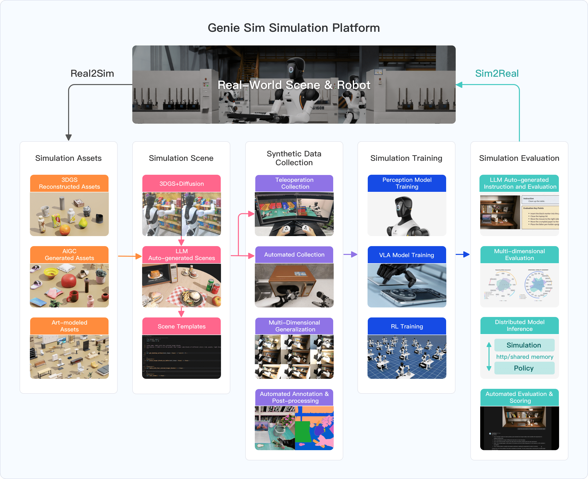
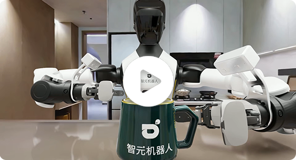

<div align="center">
  <a href="https://arxiv.org/abs/2601.02078" style="text-decoration:none;">
    
  </a>
  <a href="https://github.com/AgibotTech/genie_sim">
    
  </a>
  <a href="http://agibot-world.com/genie-sim">
    
  </a>
  <!-- <a href="https://huggingface.co/datasets/agibot-world/GenieSimAssets">
    
  </a> -->
  <a href="https://modelscope.cn/datasets/agibot_world/GenieSim3.0-Dataset">
    
  </a>
  <div align="center">
    <a href="https://agibot-world.com/videos/genieSim/modules/heroFullVideoEn.mp4" target="_blank">
      
    </a>
  </div>
</div>

# 1. Genie Sim 3.0
Genie Sim is the simulation platform from AgiBot. It provides developers with a complete toolchain for environment reconstruction, scene generalization, data collection, and automated evaluation. Its core module, Genie Sim Benchmark is a standardized tool dedicated to establishing the most accurate and authoritative evaluation for embodied intelligence.

The platform integrates 3D reconstruction with visual generation to create a high-fidelity simulation environment. It pioneers LLM-driven technology to generate vast simulation scenes and evaluation configurations in minutes. The evaluation system covers 200+ tasks across 100,000+ scenarios to establish a comprehensive capability profile for models. Genie Sim also opens over 10,000 hours synthetic dataset including real-world robot operation scenarios.

The platform will significantly accelerate model development, reduce reliance on physical hardware, and empower innovation in embodied intelligence. Simulation assets, dataset, and code are fully open source.

# 2. Features
- **High-Fidelity Sim-Ready Assets**: 5,140 validated 3D assets covering five real-world operation fields: retail, industry, catering, home and office. [ModelScope](https://modelscope.cn/datasets/agibot_world/GenieSimAssets).
- **3DGS-based Reconstruction Pipeline**: Integrate 3DGS-based reconstruction process with visual generative model to synthesize realistic simulation environment with high-precision meshes. [ModelScope](https://modelscope.cn/datasets/agibot_world/GenieSim3.0-Dataset).
- <b><big>Genie Sim World: A multimodal spatial world model which generates photorealistic 3D world from diverse input types in minutes.</big></b> [GitHub](source/geniesim_world).
- **LLM-Driven Scene Generation**: Natural language-driven generation and generalization which instantly generates diverse simulation scenes through conversational interaction.
- **Large-Scale Synthetic Dataset**: Over 10,000 hours open-source synthetic data across 200+ loco-manipulation tasks with multi-sensor streams, alongside multi-dimensional variations.
- **Synthetic Data Generation**: Efficient toolkit for data collectoin with error-recovery mechanism, supporting both low-latency teleoperation and automated data programming. [ModelScope](https://modelscope.cn/datasets/agibot_world/GenieSim3.0-Dataset).
- **Robust and Diverse Benchmark**: Provide 100,000+ simulation scenarios and use LLM to autonomously generate task instructions and evaluation configurations. Discrepancy between simulation and real-world test results is less than 10%.
- **VLM-based Auto-Evaluation System**: Full-spectrum evaluation criteria to provide model's capability profile covering manipulation skills, cognitive comprehension and task complexity.
- **Zero-Shot Sim-to-Real Transfer**: Model trained with our synthetic data exhibits zero-shot sim-to-real transfer capability with superior task success rate compared to model trained with real data.

# 3. Updates
- [4/8/2026] v3.1
  - <b><big>Release Genie Sim World: a multimodal spatial world model for 3D world generation</big></b>
  - Update new benchmarks for instruction following, spatial understanding, manipulation skills, robustness, and sim2real
  - Support human-in-the-loop and distributed reinforcement learning pipeline of RLinf
- [1/7/2026] v3.0
  - Update Isaac Sim to v5.1.0 and support RTX 50series graphic card
  - Provide USD and URDF files of Agibot Genie G2 robot and support whole body control
  - Support 3DGS-based scene reconstruction and convert output to USD format for application in Isaac Sim
  - Release synthetic dataset and corresponding data collection pipeline
  - Add LLM-based features to generate scenarios, task instructions and evaluation configurations
- [7/14/2025] v2.2
  - Provide detailed evaluation metrics for all Agibot World Challenge tasks
  - Add automatic evaluation script to run each task multiple times and record score of all steps
- [6/25/2025] v2.1
  - Add 10 more manipulation tasks for Agibot World Challenge 2025 including all simulation assets
  - Open-source synthetic datasets for 10 manipulation tasks on [Huggingface](https://huggingface.co/datasets/agibot-world/AgiBotWorldChallenge-2025/tree/main/Manipulation-SimData)
  - Integrate UniVLA policy and support model inference simulation evaluation
  - Update IK solver sdk which supports cross-embodiment IK solving for other robots
  - Optimize communication framework and improve simulation running speed by 2x
  - Update automatic evaluation framework for more complicated long-range tasks

# 4. Documentation

## 4.1 Documentations
Please refer to these links to install Genie Sim and download assets and dataset:

- [User Guide](https://agibot-world.com/sim-evaluation/docs/#/v3)
- [Assets](https://modelscope.cn/datasets/agibot_world/GenieSimAssets)
- [Dataset](https://modelscope.cn/datasets/agibot_world/GenieSim3.0-Dataset)

## 4.2 Genie Sim Benchmark Leaderboard

<table>
<tr>
<td valign="top">

### GenieSim-Instruction

| Tasks | &pi;<sub>0.5</sub> | GR00T-N1.6 | &pi;<sub>0</sub> |
|:------|:---:|:---:|:---:|
| pick_block_number | **0.711** | 0.272 | 0.193 |
| pick_block_shape | **0.475** | 0.200 | 0.117 |
| pick_common_sense | **0.300** | 0.188 | 0.038 |
| pick_follow_logic_or | **0.650** | 0.500 | 0.150 |
| pick_object_type | **0.825** | 0.513 | 0.213 |
| pick_specific_object | **0.713** | 0.388 | 0.263 |
| straighten_object | **0.650** | 0.350 | 0.500 |
| pick_billiards_color | **0.863** | 0.588 | 0.400 |
| pick_block_color | **0.900** | 0.570 | 0.410 |
| pick_block_size | **0.925** | 0.525 | 0.400 |
| **Avg.** | **0.646** | 0.409 | 0.268 |

</td>
<td valign="top">

### GenieSim-Robust

| Generalization | &pi;<sub>0.5</sub> | GR00T-N1.6 | &pi;<sub>0</sub> |
|:------|:---:|:---:|:---:|
| Reference | **0.900** | 0.610 | 0.455 |
| Instruction | **0.920** | 0.540 | 0.390 |
| Robot Init Base | **0.890** | 0.640 | 0.350 |
| Robot Init Joint | **0.830** | 0.440 | 0.410 |
| Robot End Effector | **0.450** | 0.270 | 0.230 |
| Control Delay | **0.680** | 0.560 | 0.370 |
| Camera Frame Drop | **0.740** | 0.000 | 0.040 |
| Camera Noise | **0.910** | 0.520 | 0.390 |
| Camera Occlusion | **0.940** | 0.540 | 0.450 |
| Camera Extrinsic | **0.400** | 0.190 | 0.160 |
| Ambient Lighting | **0.910** | 0.560 | 0.420 |
| Background | **0.850** | 0.650 | 0.440 |
| **Avg.** | **0.785** | 0.460 | 0.342 |

</td>
</tr>
</table>

### GenieSim-Manipulation

| Tasks | &pi;<sub>0.5</sub> | GR00T-N1.6 | &pi;<sub>0</sub> |
|:------|:---:|:---:|:---:|
| Open Door | **1.000** | 0.400 | 0.500 |
| Hold Pot | **0.533** | 0.000 | 0.100 |
| Pour Workpiece | 0.800 | **0.883** | 0.475 |
| Stock and Straighten Shelf | **0.240** | 0.200 | 0.200 |
| Take Wrong Item Shelf | **1.000** | 0.867 | 0.900 |
| Scoop Popcorn | **0.850** | **0.850** | 0.650 |
| Clean the Desktop | **0.160** | 0.000 | 0.140 |
| Place Block into Box | **0.522** | 0.367 | 0.478 |
| Sorting Packages | **0.417** | 0.128 | 0.150 |
| Sorting Packages Continuous | **0.188** | 0.042 | 0.000 |
| **Avg.** | **0.571** | 0.374 | 0.359 |

### GenieSim-Sim2Real

| Tasks | Sim Env<br>*Sim Data*<br>(sim-to-sim) | Sim Env<br>*Real Data*<br>(real-to-sim) | Real Env<br>*Sim Data*<br>(sim-to-real) | Real Env<br>*Real Data*<br>(real-to-real) |
|:------|:---:|:---:|:---:|:---:|
| Select Color | **0.856** | 0.750 | **0.850** | 0.725 |
| Recognize Size | **0.930** | 0.750 | **0.938** | 0.750 |
| Grasp Targets | **0.717** | 0.540 | **0.708** | 0.583 |
| Organize Items | **0.480** | 0.450 | **0.600** | 0.400 |
| Pack in Supermarket | **1.000** | **1.000** | **0.950** | **0.950** |
| Sort Fruit | **0.900** | **0.900** | **1.000** | **1.000** |
| Place Block into Drawer | **0.900** | **0.900** | **0.850** | **0.900** |
| Bimanual Chip Handover | **0.800** | 0.700 | **0.730** | 0.710 |
| **Avg.** | **0.823** | 0.749 | **0.828** | 0.752 |

> <sup>&dagger;</sup> *Sim Data: 500~1500 episodes of simulation data. Real Data: 500 episodes of real-world data.*


## 4.3 Support


## 4.2 Roadmap
- [x] Release more long-horizon benchmark mainuplation tasks
- [x] More scenes and assets for each benchmark task
- [x] Support Agibot World Challenge baseline model
- [x] Scenario layout and manipulation trajectory generalization toolkit
- [x] Provide dockfile and tutorial for scene reconstruction pipeline
- [x] Update motion control toolkit to support Genie G2 teleoperation in simulation
- [x] Support human-in-the-loop and distributed reinforcement learning pipeline of RLinf
- [ ] Upload all assets and dataset on Huggingface
- [ ] Support more tasks and larger models for RLinf

## 4.3 License and Citation

All the data and code within `source/geniesim` and `source/data_collection` are under `Mozilla Public License 2.0`. The `source/scene_reconstruction` project contains code under multiple licenses, for complete and updated licensing details, please see the LICENSE files

Please consider citing our work either way below if it helps your research.

```
@misc{yin2026geniesim30,
  title={Genie Sim 3.0 : A High-Fidelity Comprehensive Simulation Platform for Humanoid Robot},
  author={Chenghao Yin and Da Huang and Di Yang and Jichao Wang and Nanshu Zhao and Chen Xu and Wenjun Sun and Linjie Hou and Zhijun Li and Junhui Wu and Zhaobo Liu and Zhen Xiao and Sheng Zhang and Lei Bao and Rui Feng and Zhenquan Pang and Jiayu Li and Qian Wang and Maoqing Yao},
  year={2026},
  eprint={2601.02078},
  archivePrefix={arXiv},
  primaryClass={cs.RO},
  url={https://arxiv.org/abs/2601.02078},
}
```

## 4.4 References
1. PDDL Parser (2020). Version 1.1. [Source code]. https://github.com/pucrs-automated-planning/pddl-parser.
2. BDDL. Version 1.x.x [Source code]. https://github.com/StanfordVL/bddl
3. CUROBO [Source code]. https://github.com/NVlabs/curobo
4. Isaac Lab [Source code]. https://github.com/isaac-sim/IsaacLab
5. Omni Gibson [Source code]. https://github.com/StanfordVL/OmniGibson
6. The Scene Language [Source code]. https://github.com/zzyunzhi/scene-language
7. COAL [Source code]. https://github.com/coal-library/coal
8. OCTOMAP [Source code]. https://github.com/OctoMap/octomap
9. PINOCCHIO [Source code]. https://github.com/stack-of-tasks/pinocchio
10. URDFDOM [Source code]. https://github.com/ros/urdfdom
11. LIBCCD [Source code]. https://github.com/danfis/libccd
12. LIBMINIZIP [Source code]. https://github.com/switch-st/libminizip
13. LIBODE [Source code]. https://github.com/markmbaum/libode
14. LIBURING [Source code]. https://github.com/axboe/liburing
15. MuJoCo [Source code]. https://github.com/google-deepmind/mujoco
