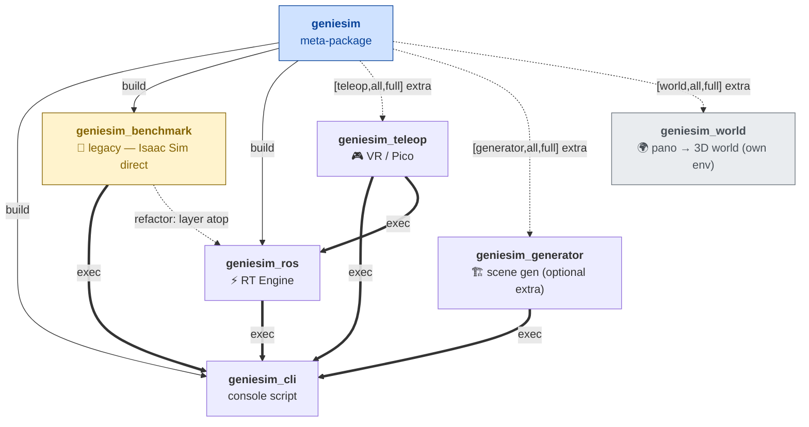

# source/ — Genie Sim Module Map

Genie Sim is shipped as a fan-out of **peer Python packages** plus a couple
of non-`geniesim` modules. Each module lives under `source/<name>/` and is
self-contained: it has its own `pyproject.toml`, its own docs, and (for
the agent-driven workflows) its own `skills/` directory.

This file is the **entry index** for GitHub readers. Start here, then
click into the module you actually need.

> 🧞 **First time?** Install the CLI and bootstrap the rest of the stack
> following [`source/geniesim_cli/AGENTS.md` § 0 — Fresh-machine setup](geniesim_cli/AGENTS.md) — that's the canonical onboarding path.

---

## 📦 Genie Sim Python packages

All editable-installable via `pip install -e source/<pkg>/`. The
`geniesim` umbrella pulls them in as deps; `geniesim bootstrap` runs the
installs in topological order.

| Module | Role | Entry doc | Skills |
|---|---|---|---|
| 🧞 [`geniesim_cli/`](geniesim_cli/) | CLI dispatcher — the `geniesim` console script | [AGENTS.md](geniesim_cli/AGENTS.md) | — |
| 🌐 [`geniesim/`](geniesim/) | Umbrella meta-package — pulls in every peer | — | — |
| 🧪 [`geniesim_benchmark/`](geniesim_benchmark/) | Benchmark tasks, scoring, LLM eval configs *(legacy stack — Isaac Sim direct; will be refactored onto `geniesim_ros`)* | [README.md](geniesim_benchmark/README.md) | [run-benchmark](geniesim_benchmark/skills/run-benchmark/SKILL.md), [check-inference](geniesim_benchmark/skills/check-inference/SKILL.md) |
| 🏗️ [`geniesim_generator/`](geniesim_generator/) | Scene generation, procedural layout, LLM scene language | [AGENTS.md](geniesim_generator/AGENTS.md) | [generate-scene](geniesim_generator/skills/generate-scene/SKILL.md), [search-assets](geniesim_generator/skills/search-assets/SKILL.md), [deploy-generator](geniesim_generator/skills/deploy-generator/SKILL.md) |
| ⚡ [`geniesim_ros/`](geniesim_ros/) | **Genie Sim RT Engine** — realtime interactive ROS 2 simulation | [README.md](geniesim_ros/README.md) · [AGENTS.md](geniesim_ros/AGENTS.md) | [build-workspace](geniesim_ros/skills/build-workspace/SKILL.md), [launch-scene](geniesim_ros/skills/launch-scene/SKILL.md), [moveit-wbc](geniesim_ros/skills/moveit-wbc/SKILL.md), [add-robot](geniesim_ros/skills/add-robot/SKILL.md), [teleop-bridge](geniesim_ros/skills/teleop-bridge/SKILL.md), [record-episode](geniesim_ros/skills/record-episode/SKILL.md), [debug-physics](geniesim_ros/skills/debug-physics/SKILL.md), [material-override](geniesim_ros/skills/material-override/SKILL.md) |
| 🎮 [`geniesim_teleop/`](geniesim_teleop/) | VR / Pico teleoperation bridge | [AGENTS.md](geniesim_teleop/AGENTS.md) | [run-teleop](geniesim_teleop/skills/run-teleop/SKILL.md) |
| 🌍 [`geniesim_world/`](geniesim_world/) | Multimodal spatial world model (panorama → 3D world) | [README.md](geniesim_world/README.md) · [AGENTS.md](geniesim_world/AGENTS.md) | [generate-world](geniesim_world/skills/generate-world/SKILL.md) |

### Where do I start?

Install + docker via `geniesim_cli`, then **pick a stack** — they are
independent and parallel today:

```
geniesim_cli      → install + docker
   │
   ├── geniesim_benchmark   legacy benchmark runtime (Isaac Sim direct)
   │                        — run / score / evaluate policies headless
   │
   └── geniesim_ros         Genie Sim RT Engine (ROS 2 native)
                            — interactive sim, MoveIt, teleop, recording
```

> 🚧 **Roadmap.** `geniesim_benchmark` will be refactored into a benchmark
> layer **on top of** `geniesim_ros` so both paths share one physics +
> render stack. Until then, treat them as independent — don't unify their
> scene formats or launch graphs.

Side branches:

- **Author a new scene from a panorama** → `geniesim_world`
- **Synthesise scenes / search assets via LLM** → `geniesim_generator`
- **Train an RL policy in the loop** → `rlinf_geniesim`

---

## 🔗 Module dependency DAG

How the `geniesim_*` peers depend on each other at build time and runtime.

**Legend:** `-->|build|` build-system requires · `==>|exec|` runtime dependency · `-.->|[X] extra|` optional extra · `-.->|refactor: layer atop|` planned refactor target. Methodology + how to regenerate: see [`AGENTS.md` § Module dependency DAG — methodology](AGENTS.md#-module-dependency-dag--methodology).

<!-- AUTOGEN:deps-dag start -->

<!-- AUTOGEN:deps-dag end -->

---

## 🧩 Separately-maintained modules

These directories live under `source/` but are **not** part of the
`geniesim_*` peer set. They have their own build / run conventions,
their own release cadence, and they are not pulled in by
`geniesim bootstrap`. Some predate the `geniesim_*` reorganisation;
others are active out-of-band collaborations.

| Directory | Description |
|---|---|
| [`data_collection/`](data_collection/) | Data collection client/server, ROS nodes, aimdk protocol |
| 🎓 [`rlinf_geniesim/`](rlinf_geniesim/) | RL training (RLinf, human-in-the-loop, distributed) |
| [`scene_reconstruction/`](scene_reconstruction/) | 3D reconstruction pipeline (Dockerfile, third-party deps) |
| [`external/`](external/) | Vendored third-party code (ml-sharp, DA360, …) |

---

## 🤖 Agent SKILLs

Every `skills/<name>/SKILL.md` is self-contained and invocable by
agentic coding agents (Claude Code et al.). The skill file carries
its own trigger phrases, prerequisites, workflow, and copy-paste
commands — so an agent can drive the simulator end-to-end without
the user reading the source.

Human consumers can `cat` any skill file for the same recipe:

```bash
cat source/geniesim_ros/skills/launch-scene/SKILL.md
```

Skill conventions:

- YAML frontmatter with `name`, `description`, `license`, `metadata`.
- Sections: **When to Use** · **Critical Patterns** · **Workflow** ·
  **Commands** · **Notes** · **Resources**.
- Cross-reference related skills by name in Resources.

---

## 📜 Conventions

- **`pip install -e source/<pkg>/`** for every Python package — never
  `pip install geniesim` (not on PyPI).
- **`AGENTS.md`** is the engineer-facing routing doc for each package.
- **`README.md`** (where present) is the user-facing pitch / quickstart.
- **`skills/`** is the agent-facing recipe library — same target
  audience as a human user looking for a copy-paste guide.

When in doubt, follow the trail:
**root README** → `source/AGENTS.md` → per-package `AGENTS.md` →
per-package `skills/<name>/SKILL.md`.

---

## 🔗 Top-level pointers

- Root README: [`../README.md`](../README.md)
- Repository-wide agent doc: [`../AGENTS.md`](../AGENTS.md)
- First-principles reasoning rule: [`../.agent/FIRST_PRINCIPLES.md`](../.agent/FIRST_PRINCIPLES.md)
- Umbrella deep-dive: [`../.agent/geniesim.md`](../.agent/geniesim.md)
- CLI deep-dive: [`../.agent/geniesim_cli.md`](../.agent/geniesim_cli.md)
- RT Engine deep-dive: [`../.agent/geniesim_ros.md`](../.agent/geniesim_ros.md)
