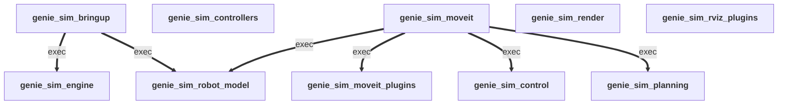

# geniesim_ros — the realtime Genie Sim engine

**Interactive realtime physics simulation for robotics, exposed natively as ROS 2.**

`geniesim_ros` is the engine that turns Genie Sim from a script-driven simulator
into a first-class ROS 2 node: USD scenes, USD robots, GPU physics, and
photoreal rendering — all driven by the same `/joint_command`, `/tf`,
`/joint_states`, `/clock`, `/odom`, and camera topics every ROS stack already
speaks. The runtime is built around **closed-loop interactivity**: teleop,
MoveIt plans, ros2_control controllers, and live RViz feedback all share the
same `sim_time` and the same world state, so a human in the loop sees and
reacts to the simulation as if it were hardware.

License: [Mozilla Public License Version 2.0](LICENSE)
Routing / contributor map: [AGENTS.md](AGENTS.md)

---

## Key features

| | |
|---|---|
| ⚡ **Interactive realtime physics** | Closed-loop sim that responds to live teleop, planner, and controller commands without buffering or replay tricks. Physics, render, and ROS publishers share a single `sim_time` so the operator and the robot agree on what's happening *now*. |
| 🧮 **Multiple physics backends, one workspace** | Pick at launch with `launcher_config:=…`: Isaac Sim PhysX (stable rigid), Isaac Sim Newton (rigid, experimental), or **Newton-standalone** (Kit-free, the only path that supports cloth + soft bodies in addition to rigid). |
| 👕 **Cloth & soft body in the loop** | Newton-standalone is designed for deformables — cloth folding, fabric drape, FEM tet bars — alongside the rigid robot. Multiple solvers are wired in so a scene yaml can opt into the one that fits the material; the engine bridges them all to the same render and RViz feedback. |
| 🦿 **Customizable robots, AS3-native assets** | `genie_sim_robot_model` ships multiple robots out of the box (Genie G2 family, Franka, UR5, Aloha, ARX, …) and lets you bring your own via xacro / URDF — the offline mesh tools normalize OBJ names, inject missing inertials, and stage the result into Isaac Sim's **AS3 asset layout** (per-robot directory with `robot.usda` + `payloads/Physics/{physics,physx,mujoco}.usda`). The engine consumes that layout uniformly; switching physics backends never rewrites the asset. |
| 🤖 **Isaac Sim 5.1 today, ready for 6.0** | The current target is Isaac Sim **5.1** (the `geniesim docker` default). Isaac Sim **6.0** support is incoming. Isaac Sim **4.5** is **EOL** — kept buildable for legacy users, no new features. Layout (AS2 flat ↔ AS3 nested), URDF→USD importer differences, and mimic-joint API differences are absorbed by runtime detection — your scene yaml doesn't change across versions. |
| 🦾 **MoveIt 2 for Genie G2** | Drop-in `move_group` + WBC RViz for the Genie G2 family (G2 is the Tier 1 robot). Ships three IK plugins (KDL-coupled, bio_ik-coupled, relaxed-IK) with G2 coupled-joint constraints, plus an RRT-Connect + TOPP-RA planner. Other robots run on the engine but don't have a packaged MoveIt config — port the SRDF and `coupled_constraints.yaml` if you need one. |
| 🎨 **OVRtx rendering, two modes** | **Inline OVRtx** runs inside the Newton-standalone process — zero-copy `body_q → omni:xform` via Warp, photoreal viewport with no IPC. **Standalone OVRtx render node** runs as a separate ROS process consuming `/tf_render`, ideal when physics and rendering need different CPU/GPU budgets. Both paths print a first-run shader-compile heartbeat so operators know warmup vs hang. |
| 📦 **Ships as a single pip wheel** | `pip install geniesim_ros` lands the pre-built colcon `--merge-install` tree (modes preserved via a tarball trick); consumers don't need colcon. Editable installs still let you `geniesim ros build dev` for iteration. |
| 🌐 **ROS 2 Jazzy** | Jazzy is the current target distro (used by the Isaac Sim 5.1 and 6.0 containers). Humble is reachable only through the EOL Isaac Sim 4.5 container and gets no new features. |
| 🛰️ **Live RViz integrations** | Custom marker / PointCloud2 publishers for deformable surfaces, free-joint rigid objects, and an RViz2-driven free-camera pose plugin. The renderer's `/tf_render` channel pushes per-body local transforms so the USD stage stays in lockstep with physics. |

---

## Quick start

Demos use **Genie G2 (Tier 1)**.

### 1. Bring up the container

```bash
geniesim docker up            # boots the Isaac Sim 5.1 + Jazzy container
geniesim docker into          # opens an interactive shell inside it
```

Run `geniesim -h` to see the container variants and the current support
matrix. The remaining steps run **inside** the container shell.

### 2. Build the ROS 2 workspace

```bash
cd /workspace                                            # repo root, mounted by `docker up`
geniesim ros build dev                                   # symlink-install, RelWithDebInfo
source devel/setup.bash                                  # overlay the built workspace
```

`geniesim ros build dev` writes to `./devel`, `./devel_build`, `./devel_log`
(intentionally namespaced so they can't collide with a release build under
`./install`).

### 3. Launch a scene

Two demo scenes × two launchers — four combinations cover the surface
most users hit. The launcher decides the **physics engine + renderer**;
the scene yaml decides the **robot variant + task**.

**Scene reference**

| Scene | Robot | What it showcases |
|---|---|---|
| `scene_pnp_g2_op` | Genie G2 + **omnipicker** | Pick-and-place workflow |
| `scene_wbc_g2_sp` | Genie G2 + **swiftpicker** | Whole-body control workflow |

**Launcher reference**

| Launcher | Physics engine | Renderer | Status |
|---|---|---|---|
| `launcher_ovrtx_isaac_physx` | Isaac Sim PhysX | Standalone OVRtx node | ✅ Stable — start here |
| `launcher_newton_mjwarp`     | Newton-standalone (mujoco-warp) | Inline OVRtx/Newton GL/RViz | ✅ Stable |

**Combinations** — any scene with any launcher:

```bash
# Pick-and-place + stable Isaac PhysX
ros2 launch genie_sim_bringup app.launch.py \
  scene:=scene_pnp_g2_op \
  launcher_config:=launcher_ovrtx_isaac_physx \
  headless:=false
```

```bash
# Pick-and-place + experimental Newton-standalone
ros2 launch genie_sim_bringup app.launch.py \
  scene:=scene_pnp_g2_op \
  launcher_config:=launcher_newton_mjwarp \
  headless:=false
```

```bash
# Whole-body control + stable Isaac PhysX
ros2 launch genie_sim_bringup app.launch.py \
  scene:=scene_wbc_g2_sp \
  launcher_config:=launcher_ovrtx_isaac_physx \
  headless:=false
```

```bash
# Whole-body control + experimental Newton-standalone
ros2 launch genie_sim_bringup app.launch.py \
  scene:=scene_wbc_g2_sp \
  launcher_config:=launcher_newton_mjwarp \
  headless:=false
```

The two axes are independent: swapping the scene changes which gripper
the robot is built with and which RViz layout / demo task you see;
swapping the launcher changes the physics backend and which OVRtx mode
runs (separate process for `launcher_ovrtx_isaac_physx`, in-process for
`launcher_newton_mjwarp`). See the
[Engine support matrix](#engine-support-matrix) below for the full grid.

### 4. (optional) MoveIt 2 + WBC RViz

MoveIt config is `arm` + `gripper` aware — pass either or both to swap
the URDF and the SRDF xacro mappings.

```bash
# Default (g2 + crsB + swiftpicker):
ros2 launch genie_sim_moveit wbc.launch.py

# crs + omnipicker:
ros2 launch genie_sim_moveit wbc.launch.py arm:=crs gripper:=omnipicker

# Mix (crs + swiftpicker, etc.):
ros2 launch genie_sim_moveit wbc.launch.py arm:=crs
```

The launch wires both args into the URDF filename and into the SRDF
xacro mappings, so any `(arm, gripper)` combo with a corresponding URDF
on disk will work. Match this to whichever `scene_*_g2_{op,sp}` you
launched in step 3 so the planner and the simulator agree on the
robot.

---

## Engine support matrix

Each row is a `launcher_config:=…` value. Mix-and-match physics + renderer
is controlled by the launcher yaml; you don't pass `physics_engine` or
`physics_solver` on the CLI.

> ⚠️ **Experimental rows are unstable.** `launcher_ovrtx_isaac_newton`
> and every `launcher_newton_*` configuration are research / preview
> code paths — physics behaviour, performance, API surface, and yaml
> schema can break between commits without notice. **Cloth and
> soft-body support is itself experimental**: it runs only on
> Newton-standalone, results are not contact-validated, and the solver
> name in a launcher filename is not a stability guarantee. Use the
> stable row (`launcher_ovrtx_isaac_physx`) for any work that needs
> reproducible behaviour.

| Launcher | Physics engine | Solver | Rigid bodies | Cloth / soft body | Renderer | Status |
|---|---|---|---|---|---|---|
| `launcher_ovrtx_isaac_physx` | Isaac Sim PhysX | PhysX 5 | ✅ | ⚠️ via PhysX (PhysxParticleCloth etc.) — not actively maintained | Standalone OVRtx node | ✅ **Stable — default** |
| `launcher_ovrtx_isaac_newton` | Isaac Sim Newton (wrapper) | mujoco-warp | 🧪 **UNSTABLE** | ❌ (wrapper bridges rigid-body schemas only) | Standalone OVRtx node | 🚨 **EXPERIMENTAL** |
| `launcher_newton_mjwarp` | Newton-standalone | mujoco-warp | ✅ | ❌ | Inline OVRtx | ✅ **Stable** |
| `launcher_newton_fsvbd` | Newton-standalone | Featherstone + VBD-family | 🧪 **UNSTABLE** |🚨 **EXPERIMENTAL** | Inline OVRtx | 🚨 **EXPERIMENTAL** |
| `launcher_newton_avbd`  | Newton-standalone | augmented-VBD-family | ✅ |🚨 **EXPERIMENTAL** | Inline OVRtx | 🚨 **EXPERIMENTAL** |
| `launcher_newton_mjvbd` | Newton-standalone | mujoco-warp + VBD-family | ✅ |🚨 **EXPERIMENTAL** | Inline OVRtx | 🚨 **EXPERIMENTAL** |
| `launcher_newton_mjxpbd` | Newton-standalone | mujoco-warp + XPBD-family | ✅ |🚨 **EXPERIMENTAL** | Inline OVRtx | 🚨 **EXPERIMENTAL** |

> Newton-standalone is the only path that even attempts cloth and soft
> bodies — Isaac Sim Newton is rigid-only today. Treat any cloth /
> soft-body result from this stack as a preview, not a benchmark.

### Isaac Sim × ROS distro × Docker variant

Matches `geniesim -h`. The `geniesim docker` variants are how this surface
is exposed; bare `geniesim docker` aliases to the default (`docker5.1`).

| Isaac Sim | ROS 2 | Container image | CLI entry | Status |
|---|---|---|---|---|
| **5.1** | **Jazzy** | `geniesim3` | `geniesim docker` / `geniesim docker5.1` | ✅ **Current target — default** |
| 6.0 | Jazzy | `geniesim4` | `geniesim docker6.0` | 🚧 Incoming, **not implemented** |
| 4.5 | Humble | `geniesim2` | `geniesim docker4.5` | ⚠️ **EOL** — kept buildable, no new features |

### Robot tiers (from `genie_sim_robot_model`)

| Tier | Robots | What it means |
|---|---|---|
| **Tier 1** | Genie G2 family (`crs` / `crsB` arm × `omnipicker` / `swiftpicker` gripper) | Continuously validated. Physics tuning, contact compliance, mimic constraints, mobile-base pin/free behaviour are all maintained against every release. MoveIt config + WBC launch are G2-only. |
| **Tier 2 — reference only** | `agilex/aloha`, `agilex/piper`, `arx/x5`, `arx/acone`, `franka/fr3`, `universal_robots/ur5` | URDF/xacro kept correct; URDF→USD import expected to work. Scene yamls and physics tuning may be stale — treat as starting points. |

Bring-your-own robots are supported via xacro / URDF — see
`genie_sim_robot_model` for the offline mesh-prep tools that stage assets
into the AS3 layout the engine consumes.

---

## What's in the box

Ten ROS packages, each with its own `AGENTS.md` for routing details:

- **Bringup & engine**: `genie_sim_bringup`, `genie_sim_engine`, `genie_sim_render`
- **Robot + visualization**: `genie_sim_robot_model`, `genie_sim_rviz_plugins`
- **Motion stack (Genie G2)**: `genie_sim_moveit`, `genie_sim_moveit_plugins`
- **ros2_control**: `genie_sim_control`, `genie_sim_controllers`
- **Python helpers**: `genie_sim_planning`

---

## 🔗 ROS-package dependency DAG

How the workspace packages depend on each other. Read from `package.xml` of every package under `src/ros_ws/src/`.

**Legend:** `-->|buildtool|` build-system toolchain (e.g. `ament_cmake`) · `-->|build|` C++/CMake build deps · `==>|exec|` runtime deps (`<exec_depend>` / `<depend>`) · `-.->|test|` test-only deps. Methodology + how to regenerate: see [`AGENTS.md` § ROS-package DAG — methodology](AGENTS.md#-ros-package-dag--methodology).

<!-- AUTOGEN:ros-dag start -->

<!-- AUTOGEN:ros-dag end -->

See [AGENTS.md](AGENTS.md) for the package table, build instructions, the
wheel-packaging contract, and the dispatch rules that make the same source
run across the supported Isaac Sim versions.
