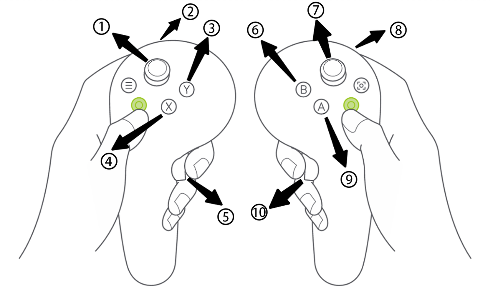

# geniesim_teleop — VR / Pico teleoperation 🎮

A VR-driven teleop loop that streams device poses into the simulator
over ROS 2, plus device drivers and a data-recording pipeline that
turns recorded rosbags into HDF5 episodes.

License: [Mozilla Public License Version 2.0](LICENSE)

---

## 🎮 Teleoperation

Support joystick control for robot waist, left/right end effector and base movement.



| No. | Function |
|:---:|---|
| 1 | move base of the robot |
| 2 | control left gripper |
| 3 | backtracking action |
| 4 | reset left arm and right arm |
| 5 | enable left arm pose tracking |
| 6 | start recording |
| 7 | control the waist of the robot |
| 8 | control right gripper |
| 9 | reset body and head |
| 10 | enable right arm pose tracking |

### Pico Setup

1. Connect to the same **LAN** as the computer.
2. Start **AIDEA Vision App** in resource library.
3. Choose **Wireless Connection** and enter the **IP** of the computer.

> **Note:** The AIDEA Vision App has been uploaded; you can access it here:
> https://modelscope.cn/datasets/agibot_world/GenieSim3.0-Dataset/tree/master/app .
> APK installation for the Pico Enterprise Edition HMD can be performed via a
> computer. When the HMD is connected via USB, its internal storage becomes
> accessible as a standard drive on the computer. The APK file can then be
> installed by copying it directly to this drive.

### Launch Setup

#### 1. Data Collection

Execute the following command under `genie_sim` root directory outside the docker
container (after `geniesim docker5.1 up` succeeds):

```bash
genie_sim$ ./source/geniesim_teleop/scripts/autoteleop.sh
```

If you want to change tasks, please modify the `task_name` and `sub_task_name`
fields in `./source/geniesim/config/teleop.yaml`.

#### 2. Data Post Process

Execute the following command under `genie_sim` root directory outside the docker
container:

```bash
genie_sim$ ./source/geniesim_teleop/scripts/autoteleop_post_process.sh {SUB_TASK_NAME}
# for example
genie_sim$ ./source/geniesim_teleop/scripts/autoteleop_post_process.sh open_door
```

> **Note:** To improve collection efficiency, data collection and data
> post-processing can be run in parallel.
