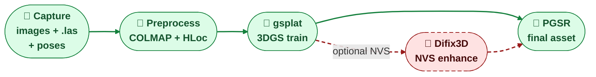
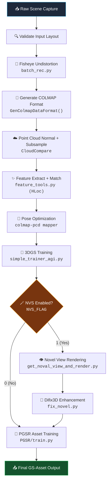
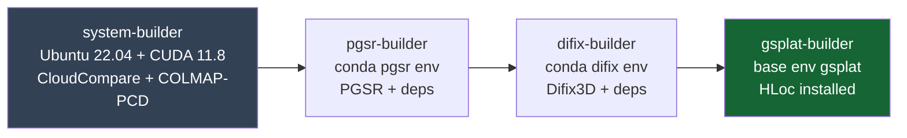
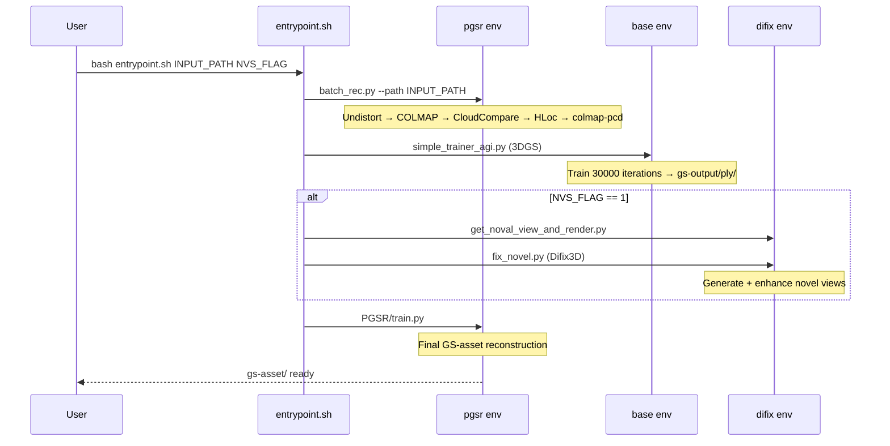

# scene_reconstruction — 3D Scene Reconstruction Pipeline 🧱

<p align="center">
  <b>Genie Sim · Scene-Level 3D Reconstruction Pipeline</b><br/>
  Dockerized · COLMAP-PCD · HLoc · gsplat · PGSR · Difix3D
</p>

<p align="center">
  
  
  
  
  
</p>

A scene-level reconstruction pipeline that supports automatically
reconstructing **high-fidelity and high-precision rendering results in
accordance with mesh data**. Takes as input a multi-view image capture +
LiDAR point cloud, and produces a **PGSR Gaussian-splatting asset**
suitable for downstream Genie Sim / Isaac Sim use.

License: see [LICENSE](LICENSE) (multi-license — third-party components carry their own terms)
Agent doc: [AGENTS.md](AGENTS.md) (contract for contributors / AI agents)

> 🚧 Separately-maintained module — not part of the `geniesim_*` peer
> set, not installed by `geniesim bootstrap`. Has its own Docker build
> and its own release cadence. See [`../README.md`](../README.md) for
> the module map.

---

## 🧭 Table of Contents

| Section | Description |
|---|---|
| [⚡ Quick start](#-quick-start) | TL;DR commands for experienced users |
| [🛰️ Pipeline at a glance](#%EF%B8%8F-pipeline-at-a-glance) | End-to-end flow + script-to-stage map |
| [📁 Source layout](#-source-layout) | Important file locations |
| [🐳 Docker build](#-docker-build) | Building the image |
| [🚀 Docker runtime](#-docker-runtime) | Running the container |
| [🧪 Environment matrix](#-environment-matrix) | Conda environments and their responsibilities |
| [📦 Input data format](#-input-data-format) | Required input layout + schemas |
| [✅ Data validation](#-data-validation) | Pre-flight checks |
| [🏃 Run reconstruction](#-run-reconstruction) | Actual execution commands |
| [🎛️ Key parameters](#%EF%B8%8F-key-parameters) | Tunable parameters and thresholds |
| [📤 Expected outputs](#-expected-outputs) | Output directory structure |
| [🪵 Logging](#-logging) | Run environment capture |
| [💾 Weights cache](#-weights-cache) | Pre-load network weights |
| [📌 Pinned dependencies](#-pinned-dependencies) | Version-locked third-party components |
| [🧯 Troubleshooting](#-troubleshooting) | Common issues and fixes |
| [🔒 Licensing](#-licensing) | Multi-license obligations |
| [🔗 References](#-references) | Upstream repos |

---

## ⚡ Quick start

> 💡 For experienced users. See detailed sections below for explanations.

```bash
# ╭─── Build ───╮
cd source/scene_reconstruction
docker build . -t genie-sim-scene-reconstruction:cu118

# ╭─── Run Container ───╮
docker run --gpus all -it --rm \
  --ipc=host --network=host \
  -v /ABS/PATH/to/input_scenes:/data/input_scenes \
  genie-sim-scene-reconstruction:cu118 bash

# ╭─── Inside Container: Run Reconstruction ───╮
SCENE=/data/input_scenes/<scene_name>

# Without Difix3D enhancement
bash /root/third_party/gsplat/examples/real2sim_environment_entrypoint.sh "${SCENE}" 0

# With Difix3D novel-view enhancement
bash /root/third_party/gsplat/examples/real2sim_environment_entrypoint.sh "${SCENE}" 1
```

---

## 🛰️ Pipeline at a glance



The output `gs-asset/` directory is the downstream consumable; the
optional Difix3D / novel-view branch fires when `NVS_FLAG=1` is passed
to the entrypoint.

### Full data flow



### Script-to-stage map

| Stage | Script (inside container) | Conda env |
|---|---|---|
| 🔗 End-to-end wrapper | `/root/third_party/gsplat/examples/real2sim_environment_entrypoint.sh` | mixed |
| 🎥 Preprocess + COLMAP | `/root/third_party/gsplat/examples/batch_rec.py` | `pgsr` |
| ✨ Feature matching | `/root/third_party/gsplat/examples/feature_tools.py` | `pgsr` |
| 🌈 gsplat 3DGS training | `/root/third_party/gsplat/examples/simple_trainer_agi.py` | `base` |
| 👁 Novel-view rendering | `/root/third_party/gsplat/examples/get_noval_view_and_render.py` | `difix` |
| 🧼 Difix3D fix | `/root/third_party/gsplat/examples/fix_novel.py` | `difix` |
| 🧱 PGSR training | `/root/third_party/PGSR/train.py` | `pgsr` |

---

## 📁 Source layout

```text
source/scene_reconstruction/
├── 📄 AGENTS.md              ← agent contract
├── 📄 README.md              ← this file
├── 🐳 Dockerfile             ← multi-stage build
├── 📄 LICENSE
├── 🩹 patch/
│   ├── colmap-pcd.patch
│   ├── hloc.patch
│   └── pgsr.patch
└── 📦 third_party/
    └── gsplat/
        └── examples/
            ├── real2sim_environment_entrypoint.sh  ← 🚀 main entrypoint
            ├── batch_rec.py                        ← preprocessing
            ├── feature_tools.py                    ← HLoc wrapper
            ├── simple_trainer_agi.py               ← gsplat trainer
            ├── get_noval_view_and_render.py        ← novel view
            ├── fix_novel.py                        ← Difix3D
            └── tool.py                             ← camera config + DB utils
```

During Docker build, these are additionally cloned into `/root/third_party/`:

```text
/root/third_party/
├── PGSR/                          (commit de24f1a)
├── Difix3D/                       (latest)
├── Hierarchical-Localization/     (commit e334220)
└── gsplat/                        (from source tree)
```

Plus system binaries installed via `make install` (source removed):
`CloudCompare v2.13.2`, `colmap-pcd 9cd7d9b`.

---

## 🐳 Docker build

> ⚠️ Build context **must** be `source/scene_reconstruction` (the
> Dockerfile uses `COPY . .`).

```bash
cd source/scene_reconstruction
docker build . -t genie-sim-scene-reconstruction:cu118
```

### With proxy

```bash
cd source/scene_reconstruction
docker build . -t genie-sim-scene-reconstruction:cu118 \
  --build-arg http_proxy="http://ip_addr:port" \
  --build-arg https_proxy="http://ip_addr:port"
```

### Multi-stage build structure



First build ~1 h on a fast network; subsequent builds reuse Docker's
layer cache.

---

## 🚀 Docker runtime

### Minimal interactive

```bash
docker run --gpus all -it --rm \
  --ipc=host \
  --network=host \
  genie-sim-scene-reconstruction:cu118 \
  bash
```

### Recommended (with mounts)

```bash
docker run --gpus all -it --rm \
  --ipc=host \
  --network=host \
  -v /ABS/PATH/to/input_scenes:/data/input_scenes \
  genie-sim-scene-reconstruction:cu118 \
  bash
```

> 🚫 **Do NOT** mount host directories over `/root` — this hides built dependencies (PGSR, Difix3D, HLoc, gsplat).

---

## 🧪 Environment matrix

| Env | Python | PyTorch | Primary usage | Key scripts |
|---|---:|---|---|---|
| `base` | 3.12 | cu118 | gsplat 3DGS training | `simple_trainer_agi.py` |
| `pgsr` | 3.8 | cu118 | COLMAP preprocessing, HLoc, PGSR | `batch_rec.py`, `feature_tools.py`, `train.py` |
| `difix` | 3.8 | — | Difix3D novel-view enhancement | `fix_novel.py`, `get_noval_view_and_render.py` |

### Verification

```bash
nvidia-smi
conda info --envs
conda run -n pgsr python --version   # → 3.8.x
conda run -n base python --version   # → 3.12.x
conda run -n difix python --version  # → 3.8.x
```

> 💡 Prefer `conda run -n <env> ...` in automation scripts. Use `conda activate` only inside interactive shells or scripts that source conda init.

---

## 📦 Input data format

The current pipeline (`batch_rec.py`) expects a capture-style input layout:

```text
/data/input_scenes/<scene_name>/
├── 📂 camera/
│   └── left/
│       ├── 000000.png
│       ├── 000001.png
│       └── ...
├── 📂 info/
│   └── calibration.json        ← intrinsics + distortion
├── 📄 transforms.json          ← NeRF-style camera poses (c2w)
└── ☁️ colorized.las            ← LiDAR point cloud
```

### Required files detail

| File | Required | Reader | Purpose |
|---|:---:|---|---|
| `camera/left/*.png` | ✅ | `batch_rec.py` | Raw fisheye images |
| `info/calibration.json` | ✅ | `ParseIntrinsic()` | `fl_x`, `fl_y`, `cx`, `cy`, distortion `k1-k4` |
| `transforms.json` | ✅ | `GenColmapDataFormat()` | Per-frame `transform_matrix` (4×4 c2w) |
| `colorized.las` | ✅ | CloudCompare | Dense point cloud for normal estimation |

### `calibration.json` schema

```json
{
  "cameras": [{
    "intrinsic": { "fl_x": ..., "fl_y": ..., "cx": ..., "cy": ... },
    "distortion": { "params": { "k1": ..., "k2": ..., "k3": ..., "k4": ... } }
  }]
}
```

### `transforms.json` schema

```json
{
  "frames": [
    {
      "file_path": "left/000000.png",
      "transform_matrix": [[...], [...], [...], [...]]
    }
  ]
}
```

### Generated intermediate layout

After `batch_rec.py` preprocessing, the directory gains:

```text
<scene>/
├── 📂 images/                    ← undistorted 1600×1600 pinhole images
│   ├── 000000_0.png
│   └── ...
├── 📂 colmap/sparse/0/           ← initial COLMAP model
│   ├── database.db
│   ├── cameras.txt
│   ├── images.txt
│   └── points3D.txt
├── 📄 normal_subsample.ply       ← CloudCompare output (later moved to sparse/0/)
└── 📂 sparse/0/                  ← optimized reconstruction
    ├── cameras.bin
    ├── images.bin
    ├── points3D.bin
    └── sparse.ply
```

### 📥 Download example data
[House.zip](https://modelscope.cn/datasets/agibot_world/GenieSim3.0-Dataset/tree/master/reconstruction_source_data)

---

## ✅ Data validation

Run before reconstruction:

```bash
SCENE=/data/input_scenes/<scene_name>

# ─── Existence checks ───
test -d "$SCENE"                          && echo "✅ Scene dir"    || echo "❌ Missing scene dir"
test -d "$SCENE/camera/left"              && echo "✅ Images"       || echo "❌ Missing camera/left"
test -f "$SCENE/info/calibration.json"    && echo "✅ Calibration"  || echo "❌ Missing calibration"
test -f "$SCENE/transforms.json"          && echo "✅ Transforms"   || echo "❌ Missing transforms"
test -f "$SCENE/colorized.las"            && echo "✅ Point cloud"  || echo "❌ Missing colorized.las"

# ─── Image count ───
echo "Image count: $(find "$SCENE/camera/left" -maxdepth 1 -type f | wc -l)"
find "$SCENE/camera/left" -maxdepth 1 -type f | head -5
```

### Image quality checklist

| Criterion | Importance | Notes |
|---|:---:|---|
| Sharp focus | 🔴 High | Blurry images degrade features |
| No motion blur | 🔴 High | Causes matching failures |
| Consistent exposure | 🟡 Medium | Large brightness changes confuse matching |
| Sufficient overlap | 🔴 High | ≥60% overlap between adjacent frames |
| No rolling shutter | 🟡 Medium | Distorts geometry |
| Sufficient frames | 🟡 Medium | Minimum ~30, optimal 100–500 |

---

## 🏃 Run reconstruction

### End-to-end (recommended)

The main entrypoint script orchestrates the full pipeline:

```bash
SCENE=/data/input_scenes/<scene_name>

# Without NVS / Difix3D
bash /root/third_party/gsplat/examples/real2sim_environment_entrypoint.sh "${SCENE}" 0

# With NVS + Difix3D enhancement
bash /root/third_party/gsplat/examples/real2sim_environment_entrypoint.sh "${SCENE}" 1
```

### Step-by-step (for debugging)

```bash
SCENE=/data/input_scenes/<scene_name>
cd /root/third_party/gsplat/examples

# ① Preprocessing: fisheye undistort + COLMAP format + point cloud + feature matching + pose optimization
conda run -n pgsr python3 batch_rec.py --path "${SCENE}/"

# ② gsplat 3DGS training
conda run -n base python3 simple_trainer_agi.py default \
  --data_dir "${SCENE}/" \
  --result_dir "${SCENE}/gs-output/"

# ③ [Optional] Novel-view rendering + Difix3D
conda run -n difix python3 get_noval_view_and_render.py \
  --dataset_path "${SCENE}/novel" \
  --images_bin_path "${SCENE}/sparse/0/images.bin" \
  --checkpt_ply_path "${SCENE}/gs-output/ply/point_cloud_29999.ply" \
  --points3d_ply_path "${SCENE}/sparse/0/sparse.ply" \
  --batch_size 16

conda run -n difix python3 fix_novel.py \
  --input_dir "${SCENE}/novel/images_novel_view" \
  --output_dir "${SCENE}/novel/images" \
  --difix_src_path /root/third_party/Difix3D/src \
  --model_path /root/third_party/Difix3D/hf_model \
  --batch_size 1 --device cuda:0

# ④ PGSR final asset training
cd /root/third_party/PGSR
conda run -n pgsr python3 train.py \
  -s "${SCENE}/novel" \
  -m "${SCENE}/gs-asset" \
  -r1 --ncc_scale 0.5 --exposure_compensation
```

### Sequence diagram



---

## 🎛️ Key parameters

### `batch_rec.py` arguments

| Parameter | Default | Description |
|---|---:|---|
| `--path` | (required) | Scene root directory |
| `--id2` | `13` | Second image ID for COLMAP initialization pair |
| `--max_depth` | `10.0` | Maximum depth for mesh generation |

### Built-in thresholds (in code)

| Constant | Value | Location | Purpose |
|---|---:|---|---|
| Static frame threshold | 0.1m / 0.5° | `is_static_pose()` | Filter static frames |
| Keyframe threshold | 0.5m / 17° | `should_keep_frame()` | Keep only useful frames |
| Hierarchical mapper | >600 images | `OptimizePose()` | Switch to block reconstruction |
| Undistort output size | 1600×1600 | `CameraPatchConfig` | Pinhole image resolution |
| Pinhole FOV | 90° | `CameraPatchConfig` | Generated camera FOV |

### When to adjust

| Situation | Adjustment |
|---|---|
| COLMAP mapper fails to initialize | Change `--id2` to a pair with more overlap |
| Too few frames after filtering | Lower keyframe thresholds in `batch_rec.py` |
| OOM during PGSR | Reduce image resolution or `--ncc_scale` |
| Large scene (>600 images) | Automatic: uses `hierarchical_mapper` |

---

## 📤 Expected outputs

```text
/data/input_scenes/<scene_name>/
│
├── 📂 images/                     ← undistorted pinhole images (1600×1600)
├── 📂 colmap/sparse/0/            ← initial COLMAP model
├── 📂 sparse/
│   ├── 0/                         ← optimized pose + sparse point cloud
│   │   ├── cameras.bin
│   │   ├── images.bin
│   │   ├── points3D.bin
│   │   └── sparse.ply
│   └── log/                       ← COLMAP-PCD logs
├── 📂 gs-output/                  ← gsplat 3DGS output
│   └── ply/
│       └── point_cloud_29999.ply
├── 📂 novel/                      ← [if NVS_FLAG=1]
│   ├── images_novel_view/         ← raw novel view renders
│   └── images/                    ← Difix3D enhanced
├── 📂 gs-asset/                   ← 🎯 PGSR final reconstruction asset
└── 📂 log/
    └── process.log
```

### Output ownership

| Output | Producer | Consumer |
|---|---|---|
| `images/` | `batch_rec.py` | HLoc, COLMAP-PCD, gsplat |
| `colmap/sparse/0/` | `GenColmapDataFormat()` | COLMAP-PCD |
| `sparse/0/` | `colmap-pcd mapper` | gsplat, PGSR |
| `gs-output/` | `simple_trainer_agi.py` | novel-view rendering |
| `novel/` | `get_noval_view_and_render.py` + `fix_novel.py` | PGSR |
| **`gs-asset/`** | `PGSR/train.py` | **downstream Genie Sim / Isaac Sim** |

> ⚠️ The current pipeline writes outputs **under the input scene directory**. For isolated experiments, copy input to a timestamped directory first:
>
> ```bash
> RUN_ID=$(date +"%Y%m%d_%H%M%S")
> WORK_DIR=/data/outputs/<scene_name>/${RUN_ID}
> cp -r /data/input_scenes/<scene_name> "${WORK_DIR}"
> bash /root/third_party/gsplat/examples/real2sim_environment_entrypoint.sh "${WORK_DIR}" 0
> ```

---

## 🪵 Logging

`batch_rec.py` auto-creates `<scene>/log/process.log`. For richer logging:

```bash
SCENE_NAME=<scene_name>
INPUT_DIR=/data/input_scenes/${SCENE_NAME}
OUTPUT_DIR=/data/outputs/${SCENE_NAME}
mkdir -p "${OUTPUT_DIR}/logs"

{
  echo "═══════════════════════════════════════════"
  echo "🕐 date: $(date)"
  echo "🖥️ hostname: $(hostname)"
  echo "📂 pwd: $(pwd)"
  echo "🐳 image: genie-sim-scene-reconstruction:cu118"
  echo "📥 input: ${INPUT_DIR}"
  echo "📤 output: ${OUTPUT_DIR}"
  echo "═══════════════════════════════════════════"
  nvidia-smi || true
  conda info --envs || true
  git -C /root rev-parse HEAD 2>/dev/null || echo "no git"
} | tee "${OUTPUT_DIR}/logs/run_env.txt"
```

---

## 💾 Weights cache

Either **download the weight files in advance** and put them into the
docker container, or run the code and wait for **automatic download**
— mount to avoid repeated downloads.

Expected structure (they land in `/root/.cache/torch`):

```text
/root/.cache/torch/
└── hub/
    ├── checkpoints/
    │   ├── alexnet-owt-7be5be79.pth
    │   ├── alex.pth
    │   ├── aliked-n16.pth
    │   ├── superpoint_lightglue_v0-1_arxiv.pth
    │   ├── superpoint_v1.pth
    │   └── vgg16-397923af.pth
    └── netvlad/
        └── VGG16-NetVLAD-Pitts30K.mat
```

Bind-mount this directory across container runs:

```bash
-v /ABS/PATH/to/torch_cache:/root/.cache/torch
```

so weights survive `--rm`.

---

## 📌 Pinned dependencies

> 🛑 Do NOT upgrade these casually. Each has been tested with the
> pipeline. See `AGENTS.md` for the upgrade contract.

| Dependency | Version / Commit | Notes |
|---|---|---|
| Base image | `nvidia/cuda:11.8.0-cudnn8-devel-ubuntu22.04` | CUDA 11.8 |
| CloudCompare | `v2.13.2` | Point cloud normal estimation |
| COLMAP-PCD | `9cd7d9b7f257306483dc6ecc95d4ef447335888d` | Pose optimization with LiDAR |
| PGSR | `de24f1a38b350387e8d8fe381b2cd70c1ae946e7` | Gaussian surface reconstruction |
| Hierarchical-Localization | `e33422019fee354b7887d05cf6deb525cfe47524` | Feature matching (HLoc) |
| pycolmap | `3.11.1` | COLMAP Python bindings |
| gsplat | vendored `third_party/gsplat` | 3D Gaussian splatting |
| Difix3D | latest (at build time) | Novel-view enhancement |
| Miniconda | `Miniconda3-py312_24.9.2-0` | Package manager |

### Patch checksums

| Patch | MD5 |
|---|---|
| `patch/colmap-pcd.patch` | `6b93584ad55c017ca335903ef083b084` |
| `patch/pgsr.patch` | `f4e5c2a401dc7350255f9a6de7a51310` |
| `patch/hloc.patch` | `37f8b5f5d46940c8995b7e1281546485` |

### ⚡ GPU architecture

```bash
ENV TORCH_CUDA_ARCH_LIST="8.9"
```

This targets **Ada Lovelace** GPUs (RTX 4090, L40, etc.). To support other architectures:

| Architecture | GPUs | Value |
|---|---|---|
| Turing | RTX 2080, T4 | `7.5` |
| Ampere | RTX 3090, A100 | `8.0` |
| Ampere (consumer) | RTX 3060/3070/3080 | `8.6` |
| Ada Lovelace | RTX 4090, L40 | `8.9` |
| Multi-arch | all above | `"7.5;8.0;8.6;8.9"` |

> ⚠️ Multi-arch significantly increases build time.

---

## 🧯 Troubleshooting

### Docker build

| Symptom | Cause | Fix |
|---|---|---|
| ❌ GitHub clone timeout | Network / GFW | Add `--build-arg http_proxy=...` and retry |
| ❌ CloudCompare CMake fails | Missing dep | Keep base image unchanged, check build log |
| ❌ COLMAP-PCD compile error | Patch mismatch | Verify `patch/colmap-pcd.patch` matches commit |
| ❌ gsplat CUDA build fails | Arch mismatch | Check `TORCH_CUDA_ARCH_LIST` matches your GPU |
| ⚠️ Build takes >1 hour | Normal | Multi-stage build compiles many C++ packages |

### Runtime errors

| Symptom | Cause | Fix |
|---|---|---|
| ❌ `FileNotFoundError: calibration.json` | Wrong input layout | Ensure `info/calibration.json` exists |
| ❌ `colorized.las not found` | Missing point cloud | Provide LiDAR `.las` file |
| ❌ COLMAP-PCD mapper returns empty | Bad init pair | Change `--id2` parameter |
| ❌ HLoc OOM | Too many/large images | Reduce image count or resolution |
| ❌ `No module named 'pipeline_difix'` | Wrong conda env | Must use `difix` env for Difix3D |
| ❌ PGSR OOM | Scene too large | Lower `-r` or `--ncc_scale` |
| ⚠️ Weights downloading every run | Cache not mounted | Mount `-v host_cache:/root/.cache/torch` |
| ⚠️ `sparse/0/` empty | Mapper failed | Check `<scene>/log/process.log` |
| ⚠️ Xvfb error | Display server | CloudCompare needs `xvfb-run` (pre-installed) |

### Diagnostic commands

```bash
# GPU check
nvidia-smi

# Environment check
conda info --envs

# Process log
cat /data/input_scenes/<scene>/log/process.log

# Image count after preprocessing
find /data/input_scenes/<scene>/images -type f | wc -l

# COLMAP output check
ls -la /data/input_scenes/<scene>/sparse/0/
```

---

## 🔒 Licensing

> ⚠️ This module contains code under **multiple licenses**. Do not claim single-license.

| Component | License |
|---|---|
| Pipeline scripts (AgiBot) | Mozilla Public License 2.0 |
| gsplat | Apache 2.0 |
| COLMAP-PCD | BSD |
| CloudCompare | GPL v2 |
| PGSR | Check repo license |
| Difix3D | NVIDIA license |
| HLoc | Apache 2.0 |

See [`AGENTS.md` § License preservation rules](AGENTS.md) for the
distribution contract.

---

## 🔗 References

1. The COLMAP-PCD — https://github.com/XiaoBaiiiiii/colmap-pcd
2. The gsplat — https://github.com/nerfstudio-project/gsplat
3. The PGSR — https://github.com/zju3dv/PGSR
4. The Difix3D — https://github.com/nv-tlabs/Difix3D
5. Hierarchical-Localization (HLoc) — https://github.com/cvg/Hierarchical-Localization

---

## 🔗 Pointers

- 🗺️ Module map: [`../README.md`](../README.md)
- 🏠 Repo root: [`../../README.md`](../../README.md)
- 🤖 Agent contract: [`AGENTS.md`](AGENTS.md)
